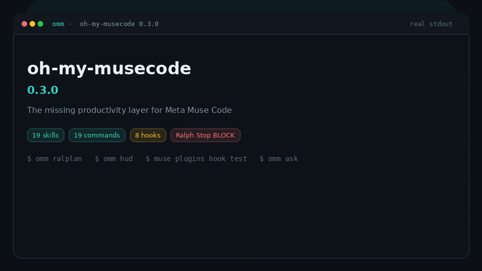

# Oh My Muse Code

**Meta Muse Code 缺少的生產力層。**

Agent：先讀 [AGENTS.md](AGENTS.md)，不必從這份 README 推敲。

Oh My Muse Code（plugin id `oh-my-musecode`，CLI `omm`）在原版 Muse 之上補上角色技能、斜線指令、session hooks，以及可持久化的 `.omm/` 狀態。

本專案**靈感來自** oh-my-openagent、oh-my-claudecode、oh-my-codex、oh-my-grok，**不是 fork**。技能、指令與 hook 原始碼皆為 Muse 原生、自行撰寫的文字。

授權：MIT。Copyright 2026 hypery11。

英文主文件：[README.md](README.md)

## 現況

| 表面 | 是否可用 |
|------|----------|
| 原生 plugin（19 技能、19 指令、8 hooks） | **Plugin 已就緒** — 請用 Muse 1.0.1-R2006.1 驗證 |
| Ralph Stop 迴圈（`decision: block`） | **已上線** — `hook test` 確認 `should_block: true` |
| `omm setup` / `omm doctor` | **已實作**（本地 CLI，無依賴） |
| `omm hud` | **已實作** — `.omm/` 文字快照（不是即時 TUI） |
| `omm team` `ask` `wait` `mission` `wiki` `update` | **CLI 占位** — 只印 `planned: ...` |
| 斜線指令 `/team` `/ask` `/hud` 等 | **Plugin 已就緒**（會話內模板，不是即時 tmux HUD） |

本版**沒有**即時 tmux 團隊儀表板或遠端 ask 傳輸。請勿假設那些功能已經能跑。

Muse 1.0.1 的 plugin API 仍是**實驗功能**，必須設定 `MUSE_EXPERIMENTAL_PLUGINS=1`。

## 安裝

需要已啟用實驗性 plugins 的 Muse Code。

本機目錄一行安裝：

    MUSE_EXPERIMENTAL_PLUGINS=1 muse plugins install /path/to/oh-my-musecode && MUSE_EXPERIMENTAL_PLUGINS=1 muse plugins approve oh-my-musecode

Marketplace（把 git remote 加進來源後）：

    export MUSE_EXPERIMENTAL_PLUGINS=1
    muse plugins marketplace add omm https://github.com/hypery11/oh-my-musecode
    muse plugins install oh-my-musecode@omm
    muse plugins approve oh-my-musecode

只驗證、不安裝：

    MUSE_NO_AUTO_UPDATE=1 MUSE_LOGIN=0 MUSE_EXPERIMENTAL_PLUGINS=1 muse plugins validate . --json

可選 CLI：

    npm i -g oh-my-musecode
    omm setup
    omm doctor

從 git checkout：

    node bin/omm.mjs setup
    node bin/omm.mjs doctor

## 原版 Muse 對照 Oh My Muse Code

| | 原版 Muse Code | 加上 oh-my-musecode |
|---|----------------|---------------------|
| 角色 | 自行準備提示 | 19 個內建技能（architect 到 git-master） |
| 斜線指令 | 僅內建 | 19 個工作流指令（`/ralph`、`/team`、`/verify` 等） |
| 會話狀態 | 聊天與 transcript | 可持久化的 `.omm/` 計畫、記憶、追蹤、驗證報告 |
| Hooks | 自己寫 | 8 個：session、關鍵字、skill gate、Ralph stop-chain、subagent 紀錄、compact 占位 |
| 多 agent | `subagent_spawn` + worktrees | 同一套 Muse 工具，加上 team roster/log 慣例 |
| 伴隨 CLI | `muse` | `omm setup` / `omm doctor` / `omm hud` 快照（其餘 `omm` 動詞為占位） |
| 實驗旗標 | plugins 需要 | 文件已標明；1.0.1-R2006.1 必開 |

## 功能

### 技能（19）

architect、planner、executor、explore、analyst、designer、debugger、tracer、critic、code-reviewer、security-reviewer、code-simplifier、test-engineer、qa-tester、verifier、scientist、document-specialist、writer、git-master

每個技能都是 Muse 角色食譜：何時啟動、如何使用 `subagent_spawn` 與 `.muse/worktrees/`、以及要寫入哪些 `.omm/` 檔。它們不會提到 Claude Code 或 Codex API。

### 指令（19）

| 指令 | 用途 |
|------|------|
| `/team` | 多技能任務與 `.omm/team/` 名單 |
| `/autopilot` | 先規劃再執行，輕量監督 |
| `/execute` | 執行一個計畫步驟或具體任務 |
| `/ralph` | 做到完成為止的迴圈（有迭代上限） |
| `/ralplan` | 給 Ralph 用的規劃訪談 |
| `/deep-interview` | 需求訪談 |
| `/ask` | 把問題路由到最適技能（會話內；CLI 為占位） |
| `/verify` | 用證據關門，而不是憑感覺 |
| `/ultragoal` | 北極星目標與第一個里程碑 |
| `/handoff` | 下一場會話交接 |
| `/skillify` | 從工作流草擬新技能 |
| `/omm-skill` | 說明內建技能 |
| `/hud` | `.omm/` 狀態的文字快照（不是即時 TUI） |
| `/omm-setup` | 印出安裝／核准步驟 |
| `/omm-doctor` | 診斷 Muse 二進位與 plugin 樹 |
| `/remember` | 持久筆記 |
| `/omm-trace` | 端到端流程追蹤 |
| `/wiki` | 輕量 `.omm/wiki/` 頁面 |
| `/debug` | 結構化除錯會話 |

### Hooks（8 支獨立腳本）

| 事件 | Id | 行為 |
|------|----|------|
| SessionStart | session-start | 可選系統訊息，列出 `/commands` |
| UserPromptSubmit | prompt-keywords | 提示含 ralph/ralplan/ultrathink/autopilot 時寫入 `.omm/mode.json` |
| PreToolUse | skill-gate | 可選：在必讀技能標記完成前拒絕會改檔的工具 |
| Stop | stop-chain | `.omm/ralph.json` 仍 active 且未達 max 時繼續 |
| SubagentStart | subagent-start | 追加 `.omm/team/log.jsonl` |
| SubagentStop | subagent-stop | 同上 |
| PreCompact | pre-compact | 占位（提醒 `.omm/`） |
| SessionEnd | session-end | 安靜寫審計 |

每個 hook 都是獨立 Python 檔（argv 來源必須唯一）。共用邏輯在 `hooks/_omm.py`，**不是** hook 來源。Hooks 不會送出裸的 `permissionDecision=allow`。

### 狀態

工作區狀態在 `.omm/`（見 `.omm/README.md`）。Plugin 原始碼是本倉庫。Muse worktrees：`.muse/worktrees/`。

### 伴隨 CLI

`package.json` 的 bin `omm` 指向 `bin/omm.mjs`（Node，無依賴）。

- `omm setup` — 印出帶實驗旗標的 Muse 安裝／核准指令
- `omm doctor` — 尋找 `muse`、檢查本樹、若找到二進位則跑 validate
- `omm hud` — `.omm/` 文字快照（不是即時 TUI）
- `omm team|ask|wait|mission|wiki|update` — 占位（`planned: ...`）
- `-h` / `--help` 與 `-V`

## 目錄

    .muse-plugin/plugin.json
    skills/<id>/SKILL.md
    commands/<id>.md
    hooks/*.py
    bin/omm.mjs
    .omm/                 （執行期；大多被 gitignore）

## 貢獻

見 [CONTRIBUTING.md](CONTRIBUTING.md) 與 [Code of Conduct](.github/CODE_OF_CONDUCT.md)。
誠實功能對照：[docs/FEATURE-MATRIX.md](docs/FEATURE-MATRIX.md)。

## 授權

MIT. Copyright (c) 2026 [hypery11](https://github.com/hypery11).
